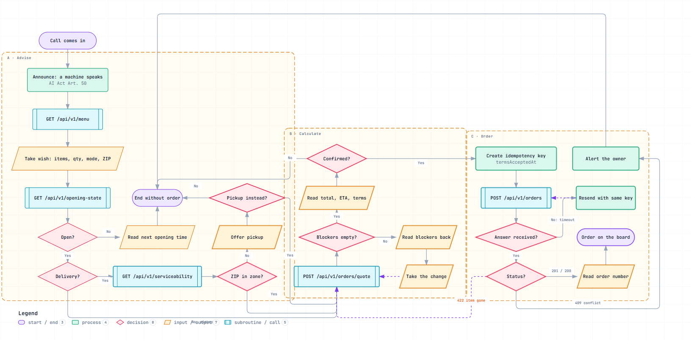
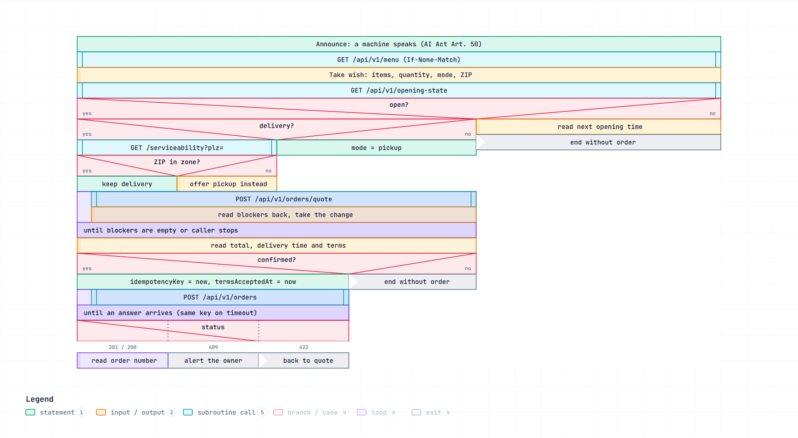
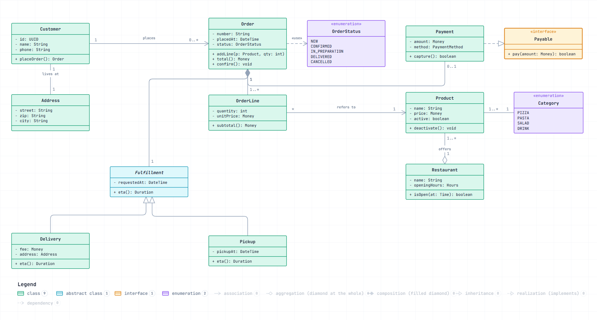
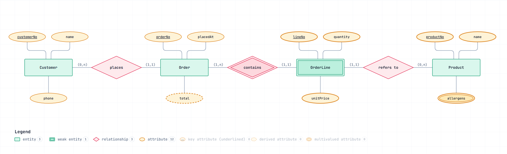
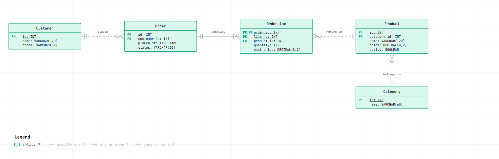
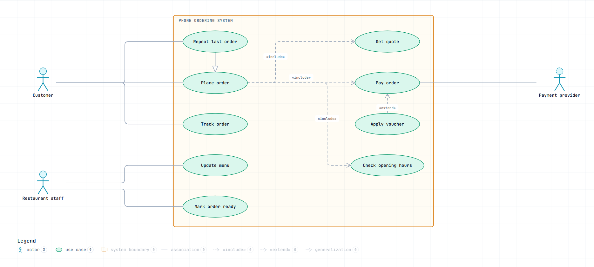
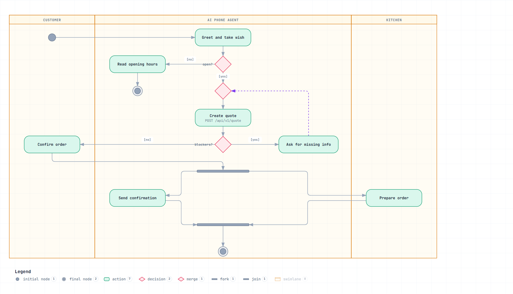
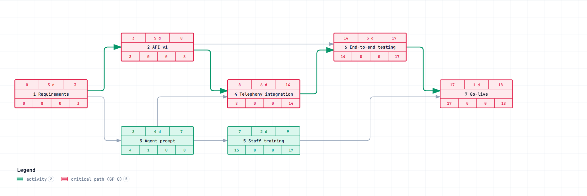
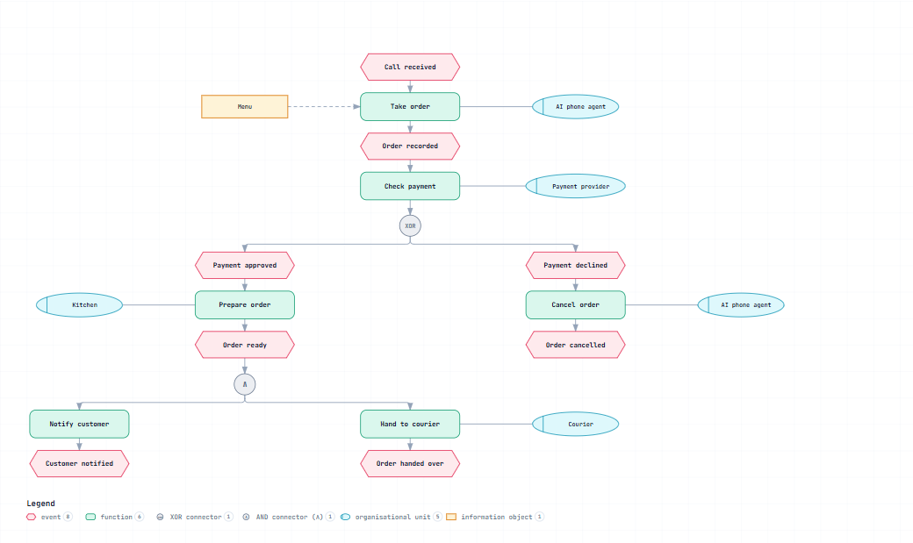

# IHK Fachinformatiker diagram types

This fork adds the diagram types German IT training (IHK Fachinformatiker
Anwendungsentwicklung / Systemintegration), project documentation and
Prüfungsaufgaben expect, on top of the five upstream types. Every type keeps
the Archify contract: explicit placement on a `col`/`row` grid, a JSON schema,
a renderer that validates and draws, a showcase example with 0 errors and
0 warnings, a golden HTML, a `node:test` suite, a SKILL router row and a guide
scenario. Agents (Claude Code, Codex, opencode) pick a type from the question
and author the JSON; humans review the rendered page.

| Type | Standard | What it answers | Example source | Rendered |
|---|---|---|---|---|
| `flowchart` | DIN 66001 / ISO 5807 Programmablaufplan | How does the algorithm branch, loop and exit? | [`order-call.flowchart.json`](../archify/examples/order-call.flowchart.json) | [HTML](../archify/examples/flowchart-order-call.html) |
| `struktogramm` | DIN 66261 Nassi-Shneiderman | Same algorithm as nested blocks, no arrows | [`order-call.struktogramm.json`](../archify/examples/order-call.struktogramm.json) | [HTML](../archify/examples/struktogramm-order-call.html) |
| `uml-class` | UML 2.5 Klassendiagramm | Which classes exist, how do they relate, with what multiplicities? | [`order-domain.uml-class.json`](../archify/examples/order-domain.uml-class.json) | [HTML](../archify/examples/uml-class-order-domain.html) |
| `erd` | Chen `(min,max)` · IE crow's foot | Entities, attributes, cardinalities — conceptual and relational | [`order-chen.erd.json`](../archify/examples/order-chen.erd.json) · [`order-crowsfoot.erd.json`](../archify/examples/order-crowsfoot.erd.json) | [Chen](../archify/examples/erd-order-chen.html) · [crow's foot](../archify/examples/erd-order-crowsfoot.html) |
| `usecase` | UML Anwendungsfalldiagramm | Actors, system boundary, include / extend | [`phone-ordering.usecase.json`](../archify/examples/phone-ordering.usecase.json) | [HTML](../archify/examples/usecase-phone-ordering.html) |
| `activity` | UML Aktivitätsdiagramm | Process with responsibilities (swimlanes), decisions, fork / join | [`phone-order.activity.json`](../archify/examples/phone-order.activity.json) | [HTML](../archify/examples/activity-phone-order.html) |
| `netzplan` | DIN 69900 Vorgangsknotennetzplan | Schedule: FAZ / FEZ / SAZ / SEZ, float, critical path | [`rollout.netzplan.json`](../archify/examples/rollout.netzplan.json) | [HTML](../archify/examples/netzplan-rollout.html) |
| `epk` | ereignisgesteuerte Prozesskette (ARIS) | Business process: events, functions, XOR / ∧ / ∨, org units, info objects | [`phone-order.epk.json`](../archify/examples/phone-order.epk.json) | [HTML](../archify/examples/epk-phone-order.html) |

All examples describe the same domain — an AI phone agent that takes pizza
orders — so the types can be compared side by side.

## Flowchart — Programmablaufplan (DIN 66001)

Terminators, processes, labelled decision diamonds, I/O parallelograms,
subroutine calls and loops routed through channels. Contract:
[`renderers/flowchart/README.md`](../archify/renderers/flowchart/README.md).

## Struktogramm — Nassi-Shneiderman (DIN 66261)

A nested block tree (statement, io, call, if, case, while, until, for, exit)
with `split` and `weight` for column widths. Contract:
[`renderers/struktogramm/README.md`](../archify/renderers/struktogramm/README.md).

## UML class diagram — Klassendiagramm

Three-compartment classifiers (class, abstract, interface, enum) and the UML
line ends: hollow triangle, hollow / filled diamond, open arrow, dashed
realization and dependency, multiplicities and roles at the ends. Contract:
[`renderers/uml-class/README.md`](../archify/renderers/uml-class/README.md).

## ER diagram — Chen and crow's foot

`meta.notation` switches between Chen (entities, relationship diamonds,
attribute ellipses, `(min,max)`) and IE crow's foot (entity boxes with PK / FK
rows, cardinality glyphs at both ends). Contract:
[`renderers/erd/README.md`](../archify/renderers/erd/README.md).

## Use case diagram — Anwendungsfalldiagramm

Stick-figure actors outside a solid system boundary, use-case ellipses inside,
«include» / «extend» dashed arrows, generalization. Contract:
[`renderers/usecase/README.md`](../archify/renderers/usecase/README.md).

## Activity diagram — Aktivitätsdiagramm

Initial / final nodes, actions, decision and merge diamonds with guards,
fork / join bars and vertical swimlanes from column ranges. Contract:
[`renderers/activity/README.md`](../archify/renderers/activity/README.md).

## Netzplan — Vorgangsknotennetzplan (DIN 69900)

Activities with durations and finish-to-start dependencies; the renderer
computes FAZ / FEZ / SAZ / SEZ / GP / FP and highlights the critical path.
Contract: [`renderers/netzplan/README.md`](../archify/renderers/netzplan/README.md).

## EPK — ereignisgesteuerte Prozesskette

Events, functions, XOR / ∧ / ∨ connectors, organisational units and
information objects, with the EPK grammar enforced (alternation, no XOR after
an event). Contract: [`renderers/epk/README.md`](../archify/renderers/epk/README.md).

## Authoring in German

Labels are free text: write German labels (`Bestellung aufnehmen`, `(0,n)`,
`FAZ`) and keep ids in English. German words are longer — widen nodes with
`width` or shorten the text until `validate --quality showcase` reports
0 errors. Embedded in a document, the delivered HTML fits an
`<iframe srcdoc="…" scrolling="no">` with an auto-height script; the
standalone width rule (`viewBox[0] ≤ 1380`) only applies to the viewer page.
